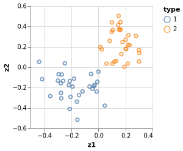

Principal component analysis is a fundamental technique to analyse and visualise data.
You will have come across it in many forms and names.
Here, we give a probabilistic perspective on PCA with some biologically motivated examples.
For more details and a mathematical derivation, we recommend Bishop's textbook (Bishop, Pattern Recognition and Machine Learning)

```julia
using Turing
using Distributions, LinearAlgebra

# Packages for visualization
using VegaLite, DataFrames

# Import example data set
using RDatasets

# Set a seed for reproducibility.
using Random
Random.seed!(1789);
```


## A basic PCA example

### Simulate data

We'll generate synthetic data to explore the models. The simulation is inspired by biological measurement of
expression of genes in cells, and so you can think of the two dimensions as cells and genes.
Admittedly, this is a very simplistic example.
Real life is much more messy.

```julia
n_cells = 60
n_genes = 15
mu_1 = 10. * ones(n_genes÷3)
mu_0 = zeros(n_genes÷3)
S = I(n_genes÷3)
mvn_0 = MvNormal(mu_0, S)
mvn_1 = MvNormal(mu_1, S)

# create a diagonal block like expression matrix, with some non-informative cells
expression_matrix = transpose(vcat(hcat(rand(mvn_1, n_cells÷2), rand(mvn_0, n_cells÷2)),
                                   hcat(rand(mvn_0, n_cells÷2), rand(mvn_0, n_cells÷2)),
                                   hcat(rand(mvn_0, n_cells÷2), rand(mvn_1, n_cells÷2))))


df_exp = convert(DataFrame, expression_matrix)
df_exp[!,:cell] = 1:n_cells

DataFrames.stack(df_exp, 1:n_genes) |>
    @vlplot(:rect, x="cell:o", color=:value, encoding={y={field="variable", type="nominal", sort="-x",
    axis={title="gene"}}})
```


### pPCA model

```julia
@model pPCA(x, ::Type{T} = Float64) where {T} = begin

  # Dimensionality of the problem.
  N, D = size(x)

  # latent variable z
  z = Matrix{T}(undef, D, N)
  for n in 1:N
    z[:, n] ~ MvNormal(D, 1.)
  end

  # weights/loadings w
  w = Matrix{T}(undef, D, D)
  for d in 1:D
    w[d, :] ~ MvNormal(D, 1.)
  end

  # mean offset
  mean = Vector{T}(undef, D)
  mean ~ MvNormal(D, 1.0)
  mu = w * z .+ mean

  for d in 1:D
    x[:,d] ~ MvNormal(mu[d,:], 1.)
  end

end
```

```
pPCA (generic function with 2 methods)
```


### pPCA inference

```julia
ppca = pPCA(expression_matrix)

# Hamiltonian Monte Carlo (HMC) sampler parameters
n_iterations = 1000
ϵ = 0.05
τ = 10

#  It is important to note that although the maximum likelihood estimates of W,\mu in the pPCA model correspond to the PCA subspace, only posterior distributions can be obtained for the latent data (points on the subspace). Neither the mode nor the mean of those distributions corresponds to the PCA points (orthogonal projections of the observations onto the subspace). However what is true, is that the posterior distributions converge to the PCA points as \sigma^2 \rightarrow 0. In other words, the relationship between pPCA and PCA is a bit more subtle than that between least squares and regression.
chain = sample(ppca, HMC(ϵ, τ), n_iterations)

describe(chain)[1]
```

```
Summary Statistics
        parameters      mean       std   naive_se      mcse       ess      
rha ⋯
            Symbol   Float64   Float64    Float64   Float64   Float64   Flo
at6 ⋯

   z[Colon(),1][1]   -0.2764    1.0252     0.0324    0.2096    8.6348    1.
131 ⋯
   z[Colon(),1][2]   -0.1575    0.8637     0.0273    0.1141   50.3658    1.
033 ⋯
   z[Colon(),1][3]    0.0037    0.9573     0.0303    0.1891   11.8810    1.
111 ⋯
   z[Colon(),1][4]   -0.0019    0.8777     0.0278    0.1357   49.8537    1.
048 ⋯
   z[Colon(),1][5]   -0.1140    0.9122     0.0288    0.1392   31.2540    0.
999 ⋯
   z[Colon(),1][6]    0.0760    1.0300     0.0326    0.1471   45.0246    1.
020 ⋯
   z[Colon(),1][7]    0.2141    1.0314     0.0326    0.2048    8.0850    1.
186 ⋯
   z[Colon(),1][8]    0.0502    0.8538     0.0270    0.1152   55.9113    1.
001 ⋯
   z[Colon(),1][9]    0.2661    0.8020     0.0254    0.0801   72.8412    1.
001 ⋯
  z[Colon(),1][10]    0.0140    0.8104     0.0256    0.0985   58.7946    1.
001 ⋯
  z[Colon(),1][11]    0.4913    1.1244     0.0356    0.1988    8.2891    1.
158 ⋯
  z[Colon(),1][12]   -0.2874    0.9402     0.0297    0.1382   33.9657    1.
048 ⋯
  z[Colon(),1][13]   -0.0450    0.8552     0.0270    0.1323   27.0250    1.
070 ⋯
  z[Colon(),1][14]   -0.5584    0.7678     0.0243    0.0994   45.6969    1.
061 ⋯
  z[Colon(),1][15]    0.1264    0.9492     0.0300    0.1702   36.4992    1.
001 ⋯
   z[Colon(),2][1]   -0.0530    0.8993     0.0284    0.1292   41.2222    1.
036 ⋯
   z[Colon(),2][2]   -0.0660    0.9698     0.0307    0.1993    4.9123    1.
309 ⋯
         ⋮              ⋮         ⋮         ⋮          ⋮         ⋮         
⋮   ⋱
                                                 2 columns and 1123 rows om
itted
```


### pPCA model check

A quick sanity check. We draw random samples from the posterior and see if this returns our input mode.

```julia
# Extract paramter estimates for plotting - mean of posterior
w = permutedims(reshape(mean(group(chain, :w))[:,2], (n_genes,n_genes)))
z = permutedims(reshape(mean(group(chain, :z))[:,2], (n_genes, n_cells)))'
mu = mean(group(chain, :mean))[:,2]

X = w * z .+ mu

df_rec = convert(DataFrame, X')
df_rec[!,:cell] = 1:n_cells

#  #  DataFrames.stack(df_rec, 1:n_genes) |> @vlplot(:rect, "cell:o", "variable:o", color=:value) |> save("reconstruction.pdf")
# DataFrames.stack(df_rec, 1:n_genes) |> @vlplot(:rect, "cell:o", "variable:o", color=:value)
DataFrames.stack(df_rec, 1:n_genes) |>
    @vlplot(:rect, x="cell:o", color=:value, encoding={y={field="variable", type="nominal", sort="-x",
    axis={title="gene"}}})
```


And finally, we plot the data in a lower dimensional space
```julia
df_pro = DataFrame(z')
rename!(df_pro, Symbol.( ["z"*string(i) for i in collect(1:n_genes)]))
df_pro[!,:cell] = 1:n_cells

DataFrames.stack(df_pro, 1:n_genes) |> @vlplot(:rect, "cell:o", "variable:o", color=:value)

df_pro[!,:type] = repeat([1, 2], inner = n_cells÷2)
df_pro |>  @vlplot(:point, x=:z1, y=:z2, color="type:n")
```




## Number of components

A common question arising in latent factor models is the choice of components, i.e. how many dimensions are needed to represent that data in the latent space.

## Batch effects

Finally, a very common issue to address in biological data is batch effects.
A batch effect occurs when non-biological factors in an experiment cause changes in the data produced by the experiment. wikipedia
As an example, considers Fisher's famous Iris data set. wikipedia

The data set consists of 50 samples each from three species of Iris (Iris setosa, Iris virginica and Iris versicolor).
Four features were measured from each sample: the length and the width of the sepals and petals, in centimeters.


## Appendix
 This tutorial is part of the TuringTutorials repository, found at: <https://github.com/TuringLang/TuringTutorials>.

To locally run this tutorial, do the following commands:
```julia, eval = false
using TuringTutorials
TuringTutorials.weave_file("11-probabilistic-pca", "11-probabilistic-pca.jmd")
```

Computer Information:
```
Julia Version 1.6.1
Commit 6aaedecc44 (2021-04-23 05:59 UTC)
Platform Info:
  OS: Linux (x86_64-pc-linux-gnu)
  CPU: Intel(R) Core(TM) i7-8550U CPU @ 1.80GHz
  WORD_SIZE: 64
  LIBM: libopenlibm
  LLVM: libLLVM-11.0.1 (ORCJIT, skylake)
Environment:
  JULIA_NUM_THREADS = 8

```

Package Information:

```
      Status `~/.julia/packages/TuringTutorials/Onn1J/tutorials/11-probabilistic-pca/Project.toml` (empty project)

```
